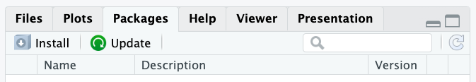

# Project Template


The `project-template` package can create a [project sturcture](#project-structure) and [template scripts](#templates-scripts) for a data science project. The package also provides tools to automate common data science tasks. The package has been developed to be used with [Visual Studio Code](https://code.visualstudio.com) for Python projects and [RStudio](https://posit.co/products/open-source/rstudio/) for R projects.

## Create

In the command line move to where you want to create the project directory and run:

```bash
cookiecutter https://github.com/NICD-UK/project-template
```

You will be prompted for the:

1. Project Name
2. Project Directory Name
3. Project Manager Name
4. Project Manager Email
5. Project Sponsor Name
6. Project Sponsor Email
7. Project Summary
8. <a name="language">Project Language</a>

In the command line run:

```bash
make
```

This command will:

1. Initialise a [reproducible environment](https://the-turing-way.netlify.app/reproducible-research/renv.html):
    - `venv` for Python
    - `renv` for R
2. Install the packages required for the template scipts
3. Save the packages to a dependencies file:
    - `requirements.txt` for Python
    - `renv.lock` for R
4. Initialise a git repository for [version control](https://the-turing-way.netlify.app/reproducible-research/vcs.html)

## Usage

To install a package in Python run:

```
venv/bin/pip install <package>
```

To install a package in R use the Packages tab in RStudio.



To save the packages to a dependencies file run:

```
make save
```

To load the packages from a dependencies file run:

```
make load
```

## Project Structure

The project has the following structure:

```
Makefile
README.md
data/
├─ clean/
├─ raw/
├─ wrangle/
models/
presentations/
reports/
├─ clean/
├─ wrangle/
src/
├─ clean/
├─ model/
├─ wrangle/
```

## Template Scripts

There are template scripts for:

1. cleaning data in `src/clean/`,
2. describing data in `reports/clean/`,
3. wrangling data in `src/wrangle/`,
4. exploring data in `reports/wrangle`

available in [Python](https://www.python.org) or [R](https://www.r-project.org). Answer **Python** or **R** to the [Language](#language) prompt during setup for the relevant template scripts. All template scripts include code to read from and write to the appropriate data directories. The template scripts for describing and exploring data generate reports for the cleaned and wrangled data, respectively. There is also a template script for presenting data in `presentations/` available in [Quarto](https://quarto.org).
