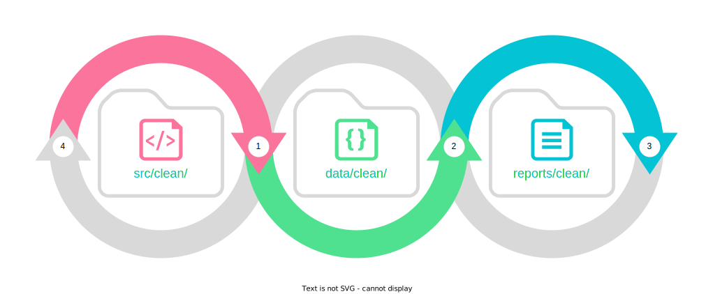
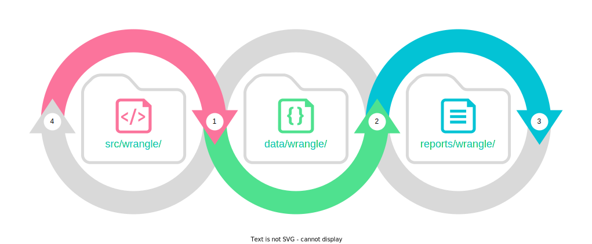

# Project Template

## Usage

To use the project template:

```
pip install cookiecutter
cookiecutter https://github.com/NICD-UK/project-template
```

You will be prompted for nine inputs:

1. Project Name
2. Project Directory Name
3. Project Manager Name
4. Project Manager Email
5. Project Sponsor Name
6. Project Sponsor Email
7. Project Summary
8. Raw Data Directory
9. Python `venv` (Yes / No)

## Organization

```
README.md
config.yml
data/
├─ clean/
├─ model/
├─ raw/
├─ wrangle/
notebooks/
reports/
├─ clean/
├─ final/
├─ wrangle/
src/
├─ clean/
├─ model/
├─ wrangle/
```

## Data Science Workflow

### 1. Business Understanding

- Determine Objectives
- Determine Deliverables
- Determine Resources
- Plan Project

### 2. Data Preparation and Understanding

- Import Data
- Clean Data
- Wrangle Data

### 3. Prototyping

- Develop Data Product
- Evaluate Data Product
- Approve Data Product

### 4. Prodution

- Deploy Data Product
- Monitor Data Product 
- Maintain Data Product
- Close Project

## Guide

### Clean Data



1. Create a cleaning script in the `src/clean` directory that imports and cleans the raw data from the `data/raw` directory and writes to the `data/clean/` directory.
2. The cleaned data is stored in the `data/clean/` directory.
3. Create a cleaning report in the `report/clean/` directory that reads the cleaned data from the `data/clean/` directory.
4. The cleaning report in the `report/clean/` directory is used to update the cleaning script in the `src/clean/` directory.

### Wrangle Data



1. Create a wrangling script in the `src/wrangle` directory that reads and wrangles the clean data from the `data/clean/` directory and writes to the `data/wrangle/` directory.
2. The wragled data is stored in the `data/wrangle/` directory.
3. Create a wrangling report in the `report/wrangle/` directory that reads the wrangled data from the `data/wrangle/` directory.
4. The wrangling report in the `report/wrangle/` directory is used to update the wrangling script in the `src/wrangle/` directory.
